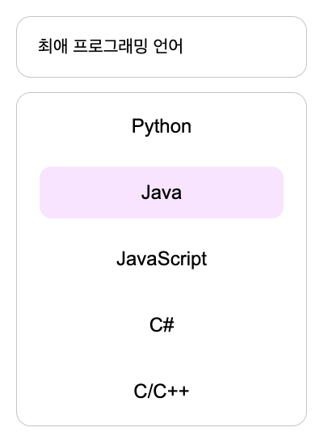

## 220419 - CSS 실무 테크닉 with 재현님 🌼

- 커스텀 input, select 박스
    1. 스타일링이 까다로운 input 요소를 숨기고 label을 연결하여 스타일링. 디자인적 개성 부여를 위해 input, select박스에 스타일 부여. 

- IR (image replacement) 기법
    - 웹 접근성 준수를 위해 이미지 사용시 대체 텍스트(alt)를 제공해야함. 단순히 스크린 리더 사용자 뿐만 아니라 검색엔진의 효과적 내용 수집을 위해서라도 필수적인 요소.
    

- CSS Sprite 기법 : 여러 이미지를 하나의 이미지 파일안에 정리하여 이미지로드 부담을 낮추는 방법.     
background-position 속성을 이용해 이미지의 특정 부분만 노출되게 한다.  https://www.toptal.com/developers/css/sprite-generator/ 를 이용하여 여러 이미지를 한 이미지로 묶을 수 있고 동시에 좌표값도 제공해줌.
다만, 유지보수관리가 힘들다.   

   

- 레티나 디스플레이 대응법
    1. 레티나 디스플레이 : 특정 시야거리에서 인간의 눈으로 화소 구분할 수 없는 화소 밀도를 가진 애플 LCD 제품의 브랜드 이름.
    2. 원인 ? : 고해상도 화면인 레티나로 넘어오면서 논리픽셀 (css에서 사용하는 화소의 기본단위)과 물리픽셀(디바이스가 실제 처리할 수 있는 화소 기본단위)의 차이가 발생. 그러나 브라우저는 css에서 준 값만큼 이미지를 렌더링 해야하기에 물리픽셀에 맞추어 렌더링 된 이미지가 논리픽셀만큼 커져버린 것.
    3. 해결방법 : 화면에 우리가 표현하고자하는 사이즈의 2배 이미지 준비.