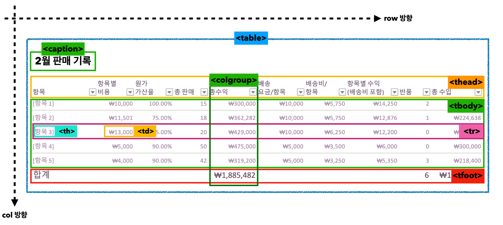

## 220405 

### [오전 : 한재현 강사님]
 - Tabular data
	```
    <table> : 표를 생성할 때 사용.
    1. caption : 테이블의 제목이나 설명제공. 테이블 요소의 첫번째 자식으로 사용. 1테이블당 1캡션.
    2. <thead>머리글 
    <tbody>본문 
    <tfoot>바닥글 
    테이블 구역을 나누는 요소. 테이블의 레이아웃에 영향미치지 않으나 CSS로 스타일 지정할 수 있음.
    3.  <tr> : 테이블 행 나눌때 사용. tr의 집합이 tbody 
    <td> : 셀을 분리할 때 사용. 
    <th> : 행, 열의 머리말. 글씨를 굵게, 가운데 정렬하여 보여줌.
    4. <colspan> : th td요소로 열간 병합. 열+열이기때문에 가로방향 셀 병합. 
    <rowspan> : 행간 병합. 행+행=세로방향 병합. 병합하고 싶은 셀의 개수 지정해주기.
    5. <colgroup>과 자식요소인 <col>. col요소를 통해 열에 공통적 스타일 줄 수 있음. colgroup안의 col요소는 각 테이블의 ‘열’을 뜻함.
    6. <scope> th요소에 scope속성을 사용해 td와 연결관계 설정 가능.
    7. col  : 행기준 제목 row : 열기준 제목
    ```



### [오후 : 이호준 강사님]

1. 블록 레벨 요소
한 줄에 하나를 다 차지하는 요소. 블록요소를 사용하면 라인이 바뀐다. 블록요소는 인라인요소까지 포함 가능.
article, header, nav, section, div

2. 인라인 요소
컨텐츠 자기의 크기만큼만 영역을 가지는 요소. 보통 인라인 요소들은 인라인 요소만 중첩 가능. 텍스트정렬의 영향을 받음. 대표적으로 span, strong 등 존재.
- span : 대표적 인라인 요소. 일부분에 속성 부여할때 사용.

—> display :  block or inline-block으로 조정.

CSS
1. cascade :  폭포가 되어 떨어지다.
스타일이 적용될 때는, 우선순위를 가지고 적용. 우선순위 적용 과정이 폭포처럼 위에서 아래로 떨어지기 때문에 이런 단어가 붙음.

- css 우선순위 : 개발자가 작성하는 외부 스타일 < head 태그 안의 스타일 < 태그 안에서 작성되는 inline스타일 < 사용자 정의 스타일 순으로 순위가 높아짐.   
하지만 사용자 정의 스타일은 오래전 엉망인 웹페이지 디자인때문에 지원하던 기능.    
요즘같은 수준높은 웹디자인의 경우 지원 중단되고 있음.


 - css 2.1 개발 후 3,4와 같은 메이저 업데이트는 없음.    
이유 1. 1에서 2로 업데이트 되는데 수많은 기능들의 추가    
이유 2. 각각 기능들이 개발되는데 의견을 받고 동의를 구하는 기간이 늘어남    
이유 3. 완료된 기능은 발표못하고 지체되는 시간 발생    
이유 4. 2 전체를 개발완료하기까지 9년의 시간이 필요했기 때문.    

—> 대신 기능등을 작은 단위로 나누어 개발하고 완료된것을 먼저 업데이트하기로 함.    
기능의 단위를 모듈이라 표현. 


2. 기본구조
selector {
property: value; —> declaration
}
일종의 스타일 명세서.

* 선택자(Selector): 스타일을 적용하고자 하는 HTML 요소를 선택
* 속성(Property): 스타일 속성 이름
* 값(Value): 속성에 대응되는 값
* 선언블록 (Declaration block) : 중괄호 안에 있는 한  덩어리
* 선언 = 속성 + 값
* 

스타일시트 적용방식
1. 인라인 방식 / 내부 스타일시트
2. 외부 스타일시트 : 파일경로를 맞추기위해 html 파일과 css파일이 같은 위치에 있어야 함. 확장자 저장은 .css
3. 다중 스타일시트 : 파일 안에 파일 포함하기!

